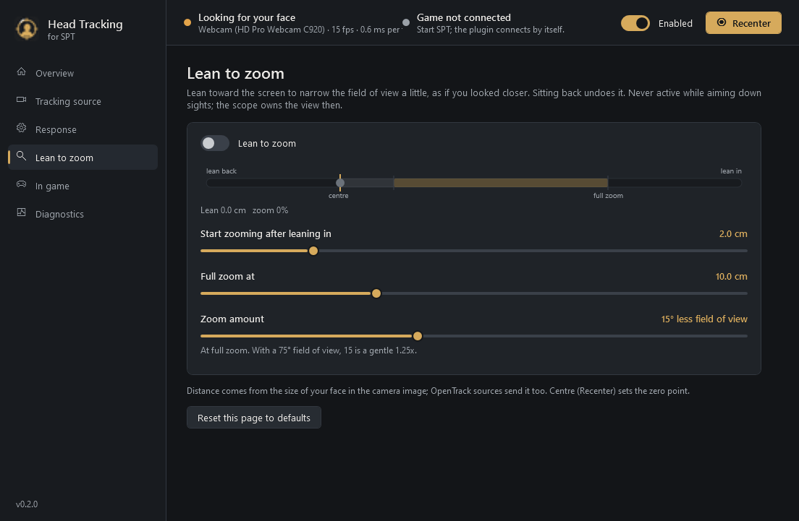
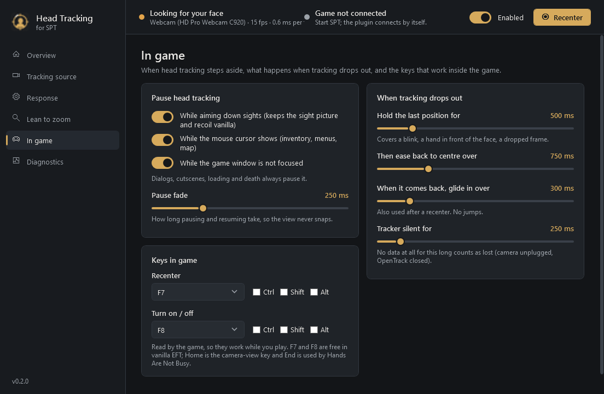

<p align="center"></p>

# Head Tracking for SPT

Look around in Escape from Tarkov (SPT) by turning your head, using an ordinary webcam. Turn your head
a little and the view turns further, so your eyes stay on the monitor. Your mouse still aims and turns
your body as normal: head tracking moves only the freelook view, the way holding the freelook key does.

It comes in two parts:

- **HeadTracking.exe**, a desktop app that sits in your SPT folder. It reads your webcam (or
  OpenTrack), works out where your head is pointing, and holds every setting, all adjustable live
  while you play.
- **A BepInEx plugin**, which applies the result to the freelook camera only when it is safe to
  (not in menus, not while aiming down sights) and reports back what the game is doing.

> **Status: 0.2.0, first public build.** The app, the webcam tracker, the link to the game and the
> plugin are built and tested outside the game (85 unit tests; the webcam pipeline checked on still
> images; the packaged app smoke-tested; the app-to-game link tested with a stand-in for the game).
> It has **not yet been played in a raid**. Expect the first in-raid test to need a setting or an
> Invert switch flipped.

## Features

- **Built-in webcam tracking.** No OpenTrack, no markers, no extra hardware. Uses OpenTrack's
  open-source neural head-pose models, run locally with ONNX Runtime (about 2 ms of CPU per frame).
- **OpenTrack input** too, for anything OpenTrack supports (TrackIR-style IR clips, ArUco markers,
  phone apps, other cameras).
- **Freelook with your head.** Yaw and pitch, with sensitivity, dead zone, maximum angle, response
  curve and invert per axis, plus adaptive smoothing (1€ filter): steady when still, quick on fast turns.
- **Lean to zoom.** Lean toward the screen to narrow the field of view a little; sit back to undo it.
- **Plays nicely with the game.** Respects EFT's own freelook limits (and mods that change them),
  pauses while aiming down sights, in menus, inventory, dialogs, cutscenes and when alt-tabbed, and
  never touches aim or recoil. Inside the dead zone the camera is exactly vanilla.
- **No snapping, ever.** Losing your face holds the view briefly, then eases back to centre;
  finding it again glides back. Pauses, recentering and switching on/off all fade.
- **In-game keys:** recenter (F7) and on/off (F8) by default, changeable in the app.
- **Live view of everything:** your head and the in-game result side by side, the response curves
  with your current position on them, a camera preview with the tracked face boxed, the game's
  state, and a full log.

## Screenshots

| Response | Lean to zoom | In game |
|---|---|---|
|  |  |  |

## Requirements

- SPT 4.1.x (EFT 0.16.9) on Windows 10 or 11, 64-bit.
- A webcam, or OpenTrack with any tracker it supports.
- Nothing else to install. The app runs on .NET Framework 4.8, which is part of Windows. If it ever
  reports that ONNX Runtime cannot load, install the
  [Microsoft Visual C++ 2015-2022 Redistributable (x64)](https://aka.ms/vs/17/release/vc_redist.x64.exe).

## Install

Download `HeadTracking-<version>.zip` from Releases and unzip it **over your SPT folder** (the one
with `EscapeFromTarkov.exe`). You get:

```
HeadTracking.exe                      <- start this
HeadTracking.exe.config
HeadTrackingApp\                      <- the app's libraries, the face models, its settings and logs
BepInEx\plugins\HeadTracking.Plugin.dll
```

## Use

1. Start **HeadTracking.exe**. The Overview page shows your head on the left pad as you move.
2. Sit as you play, look at the middle of your screen and press **Recenter**.
3. Start SPT as usual. The app's header turns to **Game connected**, and to **In raid, applying** in raid.
4. In raid, turn your head slightly. If the view goes the wrong way, flip **Invert** for that axis
   on the Response page (it applies instantly).
5. **F7** recenters, **F8** turns head tracking off and on. Aiming down sights pauses it.

Leave the app running while you play; closing it eases the view back to centre.

### The pages

| Page | What it controls |
|---|---|
| Overview | Live head and in-game pads, camera preview, lean-to-zoom meter, quick start. |
| Tracking source | Webcam or OpenTrack; which camera and picture format; model (fast, balanced, accurate); CPU threads; camera field of view; face-detection confidence; how long an unsure detector is trusted. |
| Response | Per axis: sensitivity, dead zone, furthest turn, curve, invert, each with a live graph. Smoothing and fast-movement response. Auto-centre. |
| Lean to zoom | On/off, where zoom starts, where it is full, how much field of view it takes. |
| In game | When to pause (aiming, cursor showing, window unfocused) and how fast to fade; what happens when tracking drops out (hold, return, glide back); the in-game keys. |
| Diagnostics | Plugin found or not, rates and timings, and the live log. |

### Using OpenTrack instead of the webcam tracker

Choose **OpenTrack** on the Tracking source page. In OpenTrack set Output to **UDP over network**,
IP `127.0.0.1`, port `4242`, and set the dead zones of OpenTrack's filter to 0 (this app does its own
smoothing, and OpenTrack's dead zone makes a still head look like a lost one).

## Privacy

The webcam is opened by HeadTracking.exe on your PC and each frame is analysed in memory, then
discarded. Video is never recorded, saved or sent anywhere. The only thing that leaves the app is a
few numbers per frame (the head angles), sent to the game on this same PC (127.0.0.1). Nothing about
your head goes to the SPT server or to other players.

## Multiplayer (FIKA)

Untested. By design the plugin is client-only: it changes only your own camera and leaves alone the
head-rotation value that FIKA sends to other players, so they see your mouse freelook but not your
head tracking.

## Troubleshooting

| Symptom | Look at |
|---|---|
| "Looking for your face" never changes | Diagnostics shows picture brightness: under about 40/255 the room is too dark. Face the camera; try a lower face-detection confidence. |
| "Not tracking" with an error | The message says what to do: camera in use by another program (Discord, OBS, Teams, a browser), no camera found, or Windows' camera privacy setting. |
| "Game not connected" in raid | The plugin must be in `BepInEx\plugins`. The game's log, `BepInEx\LogOutput.log`, has lines starting `[Info :Head Tracking]`; look for `Listening for HeadTracking.exe` and `HeadTracking.exe connected`. |
| The view moves the wrong way | Invert that axis on the Response page. The game's log has a `Direction check` line the first time you turn and tilt. |
| The view drifts back to centre while you hold still (OpenTrack only) | Set OpenTrack's filter dead zones to 0, or raise "OpenTrack pose frozen for" on the In game page. |

The app's log is `HeadTrackingApp\logs\HeadTracking.log` (Diagnostics > Open log folder).

## How it works

```
 webcam --> HeadTracking.exe ------------------------------- UDP 127.0.0.1:4243 --> BepInEx plugin --> freelook camera
            face detector + head-pose network (ONNX)            head offset,          pauses (menus, ADS...),
            centre, 1€ smoothing, dead zone, curve, cap         zoom, settings        game look limits, zoom (FOV)
            tracking-loss hold / return / glide            <--- UDP 127.0.0.1:4244 --- status, in-game keys
 OpenTrack -- UDP 127.0.0.1:4242 --^
```

- **Webcam tracking** is a C# port of OpenTrack's `tracker-neuralnet`: a face localizer finds the
  head, a pose network gives its rotation, centre and size, and OpenTrack's geometry turns that into
  yaw/pitch/roll and distance, corrected for the head sitting off the image centre. Frames are
  converted straight from the camera's YUV data to greyscale with no colour conversion, and the
  networks always work on the newest frame, so a slow frame costs a frame, never latency.
- **In the game**, the plugin is a Harmony prefix on `Player.VisualPass`: after the game's own
  freelook has run and before the camera is placed, it sets the camera's head rotation to *mouse
  freelook + head offset*, clamped and shaped exactly as `Player.Look` shapes mouse freelook. It
  never writes `Player.HeadRotation`, so nothing accumulates and nothing is sent to other players.
  Zoom narrows the main camera's field of view for the length of each render and puts it back
  afterwards, so the game's own FOV logic never sees it.

## Building from source

Needs the .NET 10 SDK, an SPT 4.1 install (the plugin compiles
against its patched `Assembly-CSharp.dll`), and OpenTrack 2026.1.0 installed for its model files.

```powershell
scripts\pack.ps1 -SPTPath H:\SPT4.1.X                 # build app + plugin, test, smoke-test, zip into dist\
scripts\pack.ps1 -SPTPath H:\SPT4.1.X -Install        # ...and install into that SPT folder
scripts\pack.ps1 -SPTPath H:\SPT4.1.X -ModelsPath "C:\Program Files (x86)\opentrack\modules\models"
```

| Path | |
|---|---|
| `src/HeadTracking.App` | HeadTracking.exe: WPF on .NET Framework 4.8. `Webcam/` is the tracker, `Tracking/` the head maths, `Engine/` settings, link and the engine thread, `UI/` the window. |
| `src/HeadTracking.Plugin` | The BepInEx plugin (net472). |
| `src/Shared` | The link protocol and pause logic, compiled into both. |
| `tests/HeadTracking.Tests` | xUnit tests for everything that does not need the game or a camera. |
| `scripts/fake-game.ps1` | Stands in for the game: prints what the app sends and answers like the plugin. |
| `scripts/send-test-poses.ps1` | Stands in for OpenTrack: scripted head movements, face loss and recovery, for testing without a camera. |

`HeadTracking.exe --test-image face.png --out results.txt` runs the webcam tracker on still images
(also mirrored and shifted) and reports what it finds; `--snapshot <folder>` renders every page to PNG.

## Credits

The webcam tracker is a port of [OpenTrack](https://github.com/opentrack/opentrack)'s neuralnet
tracker by Michael Welter (ISC licence), and uses its models. Camera capture by
[FlashCap](https://github.com/kekyo/FlashCap) (Apache-2.0); inference by
[ONNX Runtime](https://github.com/microsoft/onnxruntime) (MIT). See
[THIRD-PARTY-NOTICES.md](THIRD-PARTY-NOTICES.md).
