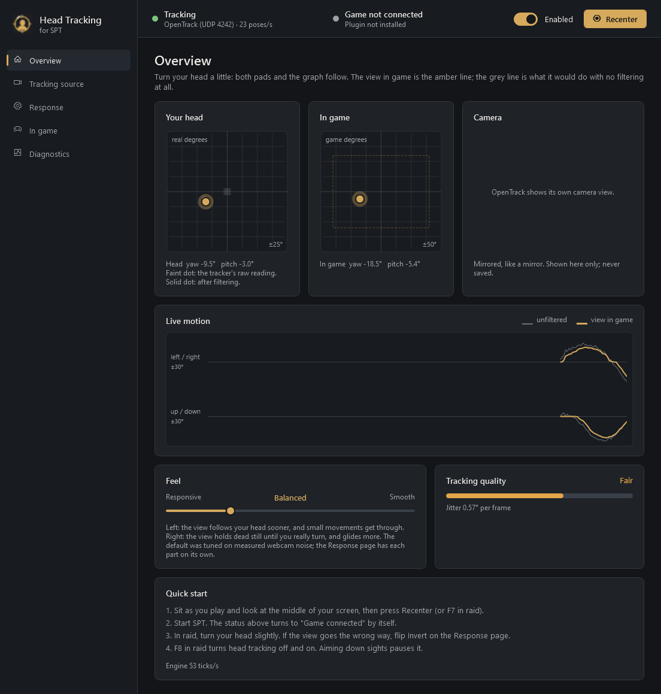
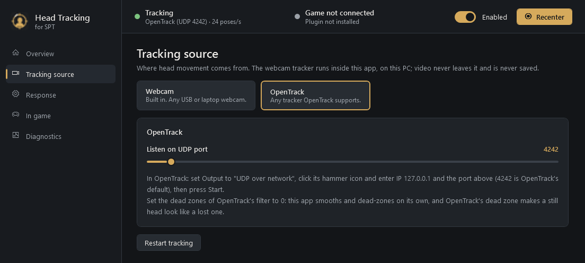
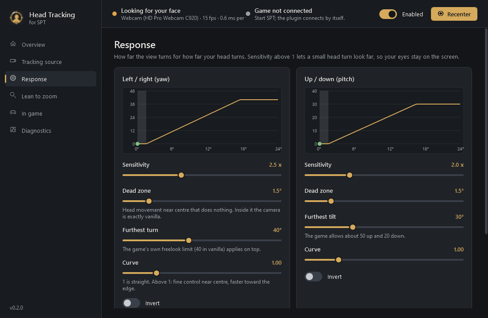

<p align="center"></p>

# Head Tracking for SPT

Look around in Escape from Tarkov (SPT) by turning your head, using an ordinary webcam. Turn your head
a little and the view turns further, so your eyes stay on the monitor. Your mouse still aims and turns
your body as normal: head tracking moves only the freelook view, the way holding the freelook key does.

It comes in two parts:

- **HeadTracking.exe**, a desktop app that sits in your SPT folder. It reads your webcam (or
  OpenTrack), works out where your head is pointing, and holds every setting, all adjustable live
  while you play.
- **A BepInEx plugin**, which applies the result to the freelook camera only when it is safe to
  (not in menus, not while aiming down sights) and reports back what the game is doing.

> **Status: 0.6.0: privacy.** The webcam now runs only while it is needed, the app window is hidden
> from screen capture and streams, ONNX Runtime's telemetry is off, and logs leave out your Windows
> user name (see [Privacy](#privacy)). 0.5.0, the first version that felt good in raid: 0.4.0 made the view smooth and still at rest, but in raid it was nauseating:
> every small head movement (talking, shifting in the seat, the shoulder that moves with a mouse
> flick) swung the view two and a half times as far. 0.5.0 makes the response gentle near centre: a
> 3° head shift now moves the view under 1° (it was almost 4°), while a deliberate turn still reaches
> the full look. A new **Sensitivity** slider on the Overview turns it down further. It also fixes a
> softness "like motion blur": 0.4.0 kept the camera inching by tiny amounts even with a still head,
> and DLSS, FSR and TAA only sharpen a picture that stops. Now a held view does not move at all.
> And it is lighter: when you are not playing, the tracker drops to an *eco* rate (about a quarter
> of the CPU), and it leaves one file in the SPT root instead of three. Not yet played in raid in
> this form.

## Features

- **Built-in webcam tracking.** No OpenTrack, no markers, no extra hardware. Uses OpenTrack's
  open-source neural head-pose models, run locally with ONNX Runtime.
- **OpenTrack input** too, for anything OpenTrack supports (TrackIR-style IR clips, ArUco markers,
  phone apps, other cameras).
- **Freelook with your head.** Yaw and pitch, with sensitivity, dead zone, maximum angle, response
  curve and invert per axis.
- **Calm near centre.** Small head movements give about the same small movement in game, as in
  real life; only bigger, deliberate turns are amplified, up to the full 40° look at about 22° of
  head turn. One **Sensitivity** slider on the Overview scales both axes.
- **A still head gives a still view.** A *stillness lock* holds the view exactly still until your
  head has moved further than the tracker's own noise. The lock measures that noise while it runs,
  so a noisier camera or a darker room is held still too. Real turns get through straight away.
  Held means exactly still, not nearly: DLSS, FSR and TAA blur a camera that keeps inching.
- **Quieter tracking at the source.** The tracker crops your face from a steadier box, and checks
  every frame a second time, mirrored, then averages the two. With the Balanced model, now the
  default, this cut the frame-to-frame noise on a Logitech C920 from 1.05° to 0.45°. The camera also
  runs at its full 30 fps; webcams halve their frame rate in dim light unless told not to.
- **One Feel slider** from *Snappy* to *Very smooth* sets all the smoothing at once. Every
  underlying setting is still there to fine-tune.
- **Smooth in game.** The view glides between camera frames at your frame rate instead of stepping
  30 times a second.
- **Private.** The camera picture never leaves memory. The camera is only on while it's needed,
  the window is hidden from screen capture and streams, and nothing goes anywhere but the game on
  this PC (see [Privacy](#privacy)).
- **Light on the PC.** The tracker uses about a fifth of one CPU core while you play, and about a
  twentieth when you are not: with no raid running, a screen open in raid, or the game alt-tabbed
  (and this window in the background), it runs at half rate without the mirrored check, and is
  back to full quality within a tenth of a second of you playing again.
- **You can see what it does.** The Overview shows a *Live motion* graph: your head angle before
  filtering against what the game shows, over the last 8 seconds. Next to it, a *Tracking quality* card rates
  the tracker's measured jitter and names the one change most likely to help, such as more light or
  the frame-rate switch.
- **Plays nicely with the game.** Respects EFT's own freelook limits (and mods that change them).
  Pauses while aiming down sights, in menus, inventory, dialogs and cutscenes, and when alt-tabbed.
  Never touches aim or recoil. Inside the dead zone the camera is exactly vanilla.
- **No snapping, ever.** Losing your face holds the view briefly, then eases back to centre;
  finding it again glides back. Pauses, recentering and switching on/off all fade.
- **In-game keys:** recenter (F7) and on/off (F8) by default, changeable in the app.

## Screenshots

| Overview | Tracking source | Response |
|---|---|---|
|  |  |  |

## Requirements

- SPT 4.1.x (EFT 0.16.9) on Windows 10 or 11, 64-bit.
- A webcam, or OpenTrack with any tracker it supports.
- Nothing else to install. The app runs on .NET Framework 4.8, which is part of Windows. If it ever
  reports that ONNX Runtime cannot load, install the
  [Microsoft Visual C++ 2015-2022 Redistributable (x64)](https://aka.ms/vs/17/release/vc_redist.x64.exe).
- CPU: the webcam tracker takes about 7 ms of CPU per camera frame with the default Balanced model
  and the mirrored check: about a fifth of one core at 30 fps, while you play (eco: a twentieth).
  Turning off "Check every frame twice" halves that for about 10% more jitter; the Fast model with
  the check costs the same as Balanced without it. Measured with `HeadTracking.exe --benchmark`.

## Install

Download `HeadTracking-<version>.zip` from Releases and unzip it **over your SPT folder** (the one
with `EscapeFromTarkov.exe`). You get:

```
HeadTracking.exe                      <- start this; the only file in the SPT root
HeadTrackingApp\                      <- everything else the app needs and writes:
    README.md, THIRD-PARTY-NOTICES.md
    lib\                                 libraries (ONNX Runtime, camera capture)
    models\                              the face models
    logs\, settings.json                 created on first start
BepInEx\plugins\HeadTracking\HeadTracking.Plugin.dll
```

**Upgrading:** close the game and the app first, then unzip over the old version. Versions up to
0.4.0 put more files in the SPT root (`HeadTracking.exe.config`, `HeadTracking-README.md`) and the
plugin loose in `BepInEx\plugins`; 0.5.0 removes those old files itself on first start. On first
start the app also moves settings that were the cause of a problem to the new defaults, and logs
what it changed:

- From 0.2.0 or 0.3.0: the smoothing settings, the model (to Balanced) and the mirrored check (on),
  because the old values were the ones that shook.
- From 0.4.0 or earlier: the response (sensitivity and curve) moves to the calmer 0.5.0 curve, but
  only if you never changed it. A response you set yourself is kept; *Reset this page to defaults*
  on the Response page gives you the new one.

Everything else (dead zones, keys, camera, Feel, pause options) is kept.

## Use

1. Start **HeadTracking.exe**. The Overview page shows your head on the left pad as you move.
2. Sit as you play, look at the middle of your screen and press **Recenter**.
3. Check the **Tracking quality** card. *Good* or *Excellent* is what you want. If it says *Fair* or
   *Poor*, follow its tip first: light and frame rate matter more than any setting.
4. Start SPT as usual. The app's header turns to **Game connected**, and to **In raid, applying** in raid.
5. In raid, turn your head slightly. If the view goes the wrong way, flip **Invert** for that axis
   on the Response page (it applies instantly).
6. **F7** recenters, **F8** turns head tracking off and on. Aiming down sights pauses it.

Leave the app running while you play; closing it eases the view back to centre.

### Tuning

Two sliders on the Overview do most of it. Watch the *Live motion* graph while you move them: the
thin grey line is your head before filtering and the thick gold line is what the game shows.

- **The view moves when you don't mean it to, or it makes you queasy:** move **Sensitivity** left.
  Small head movements then stay small, and the full look needs a bigger head turn. The label shows
  how far: "Full 40° look at 22° of head turn" is the default.
- **The view twitches while you hold still:** move **Feel** to the right. The gold line should go
  flat while the grey one wobbles.
- **The view lags behind your head or feels floaty:** move **Feel** to the left. The gold line should
  follow the grey one's turns closely. Far right adds the most lag; that end is for noisy cameras.

The Feel default (a quarter of the way along, *Balanced*) is the setting that measured best: still
at rest, about 60 ms behind a turn. The Response page has every setting behind both sliders, with
a graph of the response curve per axis and the jitter and stillness band in use right now.

### The pages

| Page | What it controls |
|---|---|
| Overview | Live head and in-game pads (the head pad's faint dot is the raw reading), the Live motion graph, the Sensitivity and Feel sliders, Tracking quality with a tip, a camera preview, a warning if the camera runs slow, quick start. |
| Tracking source | Webcam or OpenTrack. Which camera and picture format; keep the full frame rate in low light; the camera's own settings dialog; model (Fast, Balanced, Accurate); check every frame twice (mirrored); CPU threads; camera field of view; face-detection confidence; how long an unsure detector is trusted. |
| Response | Per axis: sensitivity, dead zone, furthest turn, curve and invert, each with a live graph. Smoothness: Feel, plus stillness, motion smoothing, steadiness, smoothing and fast-movement response, with the live jitter readout. Auto-centre. |
| In game | When to pause (aiming, cursor showing, window unfocused) and how fast to fade; what happens when tracking drops out (hold, return, glide back); the in-game keys. |
| Privacy | The camera's live state with *Turn camera off now* and *Turn camera on*; turn the camera off when it isn't needed, and after how long with nobody in view; hide this window from screen capture; the camera preview; save a log file, delete the log files. |
| Diagnostics | Plugin found or not, rates and timings, and the live log. |

### Using OpenTrack instead of the webcam tracker

Choose **OpenTrack** on the Tracking source page. In OpenTrack set Output to **UDP over network**,
IP `127.0.0.1`, port `4242`, and set the dead zones of OpenTrack's filter to 0. This app does its own
smoothing, and OpenTrack's dead zone makes a still head look like a lost one.

## Privacy

Everything below was checked in the code, not just intended. The app's **Privacy** page has every
choice in one place:
- the camera's live state, with *Turn camera off now* and *Turn camera on*;
- when the camera turns itself off;
- hiding the window from screen capture, and the camera preview;
- whether a log is saved, with a button to delete the log files.

**The camera picture.**
- Only HeadTracking.exe opens the webcam. Each frame is analysed in memory and then overwritten by
  the next one.
- No picture is ever recorded, saved or sent anywhere. No part of the app writes an image file from
  the camera. Its only image output is a developer mode that renders its own pages, and that mode
  never opens the camera.
- The preview exists only in the app's window. By default that window is **hidden from screen
  capture**: OBS, Discord or Teams screen share, the Snipping Tool and PrintScreen all leave it out,
  so the preview can't end up on a stream. You still see it normally. Turn it off on the Privacy
  page when you want a screenshot. The preview itself can be switched off there too.

**When the camera is on.** Only when it's needed. It runs while SPT is running or the app's window
is in front. It turns off, and its light goes out:
- 30 seconds after neither is true;
- at once when head tracking is switched off (the header switch or F8);
- after 3 minutes with nobody in view outside a raid (1 to 30, your choice). In a raid it never
  sleeps: a lost face there is you looking away.

It wakes when a raid starts, when you bring the window to the front, with F7/F8 in game, or with
*Turn camera on*. Turn off *Turn the camera off when it isn't needed* to keep it on while the app is
open.

*Turn camera off now* is different: the camera stays off until **you** turn it back on, with the
button or F7 in game. A raid starting or the window coming to the front won't undo it.

**What leaves the app.**
- Two head angles, about 30 times a second, go to the game on this PC (UDP to 127.0.0.1). The game
  sends its state (in raid, paused, frame rate) back the same way.
- Every socket listens on 127.0.0.1 only, so nothing on the network can connect. OpenTrack input is
  accepted from this PC only.
- No internet connection, no update check, no analytics.
- ONNX Runtime, the library that runs the face models, has Microsoft usage telemetry built into its
  Windows version. The app switches it off at startup, before any model is loaded. No camera data
  is in it either way.

**In the game.** The plugin changes only your own camera. It never writes `Player.HeadRotation`,
the value SPT and FIKA send, so neither the server nor other players ever receive anything about
your head.

**What stays on your PC.**
- `HeadTrackingApp\settings.json` holds your settings and the camera's name.
- `HeadTrackingApp\logs\` holds this run's log and the previous one. They record head angles, frame
  rates, picture brightness, and when a face was found or lost, so they show when you sat at the PC.
  Your Windows user name is written as `%USERPROFILE%`. Read a log before sharing it. Turn off
  *Save a log file* on the Privacy page to keep the log in memory only, and use *Delete log files
  now* to remove the saved ones.

## Multiplayer (FIKA)

Untested. By design the plugin is client-only: it changes only your own camera and leaves alone the
head-rotation value that FIKA sends to other players, so they see your mouse freelook but not your
head tracking.

## Troubleshooting

| Symptom | Look at |
|---|---|
| The view moves too much, or the game makes you feel sick | Move Sensitivity (Overview) left. If the view also trails your head, move Feel left too: the smooth end adds lag. |
| The picture goes soft or smeared while head tracking is on | Make sure you are on 0.5.0 or later: before it, the camera never fully stopped and DLSS/FSR/TAA kept the picture soft. If it blurs only while you are actually turning, that is the upscaler's motion handling, the same as with the mouse: compare with DLSS off. The game's `LogOutput.log` status line says on how many frames the head moved the view. |
| The view shakes or drifts while you hold still | The Tracking quality card on the Overview: its tip names the likeliest cause. Then move Feel to the right. The log's `Status:` line every 10 s gives the camera's real frame rate, the measured jitter and the stillness band. |
| "Looking for your face" never changes | Under about 40/255 brightness the room is too dark; the quality card says so, and Diagnostics shows the value. Face the camera; try a lower face-detection confidence. |
| The camera runs under 25 fps | Turn on "Keep the full frame rate" (Tracking source), add light, or shorten the exposure in Camera settings. |
| The header says **Camera off** | On purpose, for privacy: no game running and the window in the background, nobody in view for 3 minutes, or tracking switched off, or you pressed *Turn camera off now*. It turns on by itself when a raid starts or you bring the window to the front (not after *Turn camera off now*); *Turn camera on* on the Overview or the Privacy page does it at once. |
| A screenshot or stream shows the app as black or missing | That is *Hide this window from screen capture* (Privacy page). Turn it off for the screenshot. |
| "Not tracking" with an error | The message says what to do: camera in use by another program (Discord, OBS, Teams, a browser), no camera found, or Windows' camera privacy setting. |
| "Game not connected" in raid | The plugin must be in `BepInEx\plugins\HeadTracking`. The game's log, `BepInEx\LogOutput.log`, has lines starting `[Info :Head Tracking]`; look for `Listening for HeadTracking.exe` and `HeadTracking.exe connected`. |
| The view moves the wrong way | Invert that axis on the Response page. The game's log has a `Direction check` line the first time you turn and tilt. |
| The view drifts back to centre while you hold still (OpenTrack only) | Set OpenTrack's filter dead zones to 0, or raise "OpenTrack pose frozen for" on the In game page. |

The app's log is `HeadTrackingApp\logs\HeadTracking.log` (Diagnostics > Open log folder).

## How it works

```
 webcam --> HeadTracking.exe ------------------------------- UDP 127.0.0.1:4243 --> BepInEx plugin --> freelook camera
            face detector + head-pose network (ONNX),           head offset,          pauses (menus, ADS...),
            mirrored check, centre, steadiness, stillness lock, settings              game look limits, smooth follow
            dead zone, curve; tracking-loss hold / return  <--- UDP 127.0.0.1:4244 --- status, in-game keys
 OpenTrack -- UDP 127.0.0.1:4242 --^
```

- **Webcam tracking** is a C# port of OpenTrack's `tracker-neuralnet`. A face localizer finds the
  head, and a pose network gives its rotation, centre and size. OpenTrack's geometry turns that into
  yaw/pitch/roll and distance, corrected for the head sitting off the image centre.
  - The face crop follows the head through a damped box, so the network does not see a crop that
    shifts by a few pixels every frame.
  - With the mirrored check on, each crop also runs flipped. The flipped answer is flipped back and
    averaged with the first, which cancels much of the network's per-image error.
  - Frames are converted straight from the camera's YUV data to greyscale, and the networks always
    work on the newest frame, so a slow frame costs a frame, never latency.
  - The camera's low light compensation (UVC auto-exposure priority) is switched off through
    DirectShow. On a Logitech C920 that took it from 15 to 30 fps.
- **Filtering** happens once per camera frame, using the real time between frames.
  1. OpenTrack's soft dead zone, sized by the pose network's own per-frame uncertainty output.
  2. The stillness lock: the output stays put until the head leaves a band around it, then follows
     dragging the band, like gear backlash. The band is 1.5x the jitter measured live (a robust
     percentile of recent frame-to-frame steps), so it fits the camera and the light. While held,
     the view does not move at all. (0.4.0 let it creep toward the head; that kept the camera moving
     by slivers every frame, which temporal upscalers render as blur.)
  3. Optionally a 1€ filter, on the smoother half of the Feel slider.
  4. The response: a dead zone at centre, then a power curve (1.5 by default, keeping its end
     point) that leaves small movements near 1:1 and amplifies only bigger turns, up to the
     furthest turn.
- **In the game**, the plugin is a Harmony prefix on `Player.VisualPass`. After the game's own
  freelook has run and before the camera is placed, it sets the camera's head rotation to
  *mouse freelook + head offset*, clamped and shaped exactly as `Player.Look` shapes mouse freelook.
  - It never writes `Player.HeadRotation`, so nothing accumulates and nothing is sent to other
    players.
  - It follows the app's newest pose with a critically damped spring every rendered frame, so 30 Hz
    updates become continuous motion at 60, 144 or 240 fps. It settles to exactly zero at centre.

## Building from source

Needs the .NET 10 SDK, an SPT 4.1 install (the plugin compiles
against its patched `Assembly-CSharp.dll`), and OpenTrack 2026.1.0 installed for its model files.

```powershell
scripts\pack.ps1 -SPTPath H:\SPT4.1.X                 # build app + plugin, test, smoke-test, zip into dist\
scripts\pack.ps1 -SPTPath H:\SPT4.1.X -Install        # ...and install into that SPT folder
scripts\pack.ps1 -SPTPath H:\SPT4.1.X -ModelsPath "C:\Program Files (x86)\opentrack\modules\models"
```

| Path | |
|---|---|
| `src/HeadTracking.App` | HeadTracking.exe: WPF on .NET Framework 4.8. `Webcam/` is the tracker, `Tracking/` the head maths and filters, `Engine/` settings, link and the engine thread, `UI/` the window, `Dev/` the developer modes. |
| `src/HeadTracking.Plugin` | The BepInEx plugin (net472). |
| `src/Shared` | The link protocol, pause logic and the render-rate follow, compiled into both. |
| `tests/HeadTracking.Tests` | xUnit tests for everything that does not need the game or a camera. |
| `scripts/fake-game.ps1` | Stands in for the game: prints what the app sends and answers like the plugin. |
| `scripts/send-test-poses.ps1` | Stands in for OpenTrack: scripted head movements, face loss and recovery, and optional `-Noise`, for testing without a camera. |
| `scripts/make-icon.py` | Draws the app icon from shapes, once per size (16 to 256 px), into the .ico, the sidebar logo and `docs/icon.png`. Needs Python with Pillow. |

Developer modes of `HeadTracking.exe`. None of them keeps or shows camera pictures; they print
numbers only.

| Mode | What it does |
|---|---|
| `--test-image face.png --out results.txt` | Runs the webcam tracker on still images, also mirrored and shifted. |
| `--jitter-test face.png` | Measures how much each model and filter setting shakes on a still face with added sensor noise. |
| `--live-jitter [--csv angles.csv]` | Measures the live camera's tracking jitter for each model, crop and mirror option, with the in-game result of each filter setting. Optionally saves the head angles (numbers, not pictures) for `--replay`. |
| `--replay angles.csv` | Runs recorded or synthetic head angles through a grid of filter settings and scores each on rest motion, lag and error. |
| `--camera-test` | Measures the frame rate the camera really delivers. |
| `--benchmark face.png` | Measures the tracker's CPU per frame for each model, thread count and the mirrored check, on a still portrait (no camera). |
| `--snapshot <folder>` | Renders every page of the window to PNG. |

## Credits

The webcam tracker is a port of [OpenTrack](https://github.com/opentrack/opentrack)'s neuralnet
tracker by Michael Welter (ISC licence), and uses its models. Camera capture by
[FlashCap](https://github.com/kekyo/FlashCap) (Apache-2.0); inference by
[ONNX Runtime](https://github.com/microsoft/onnxruntime) (MIT). See
[THIRD-PARTY-NOTICES.md](THIRD-PARTY-NOTICES.md).
